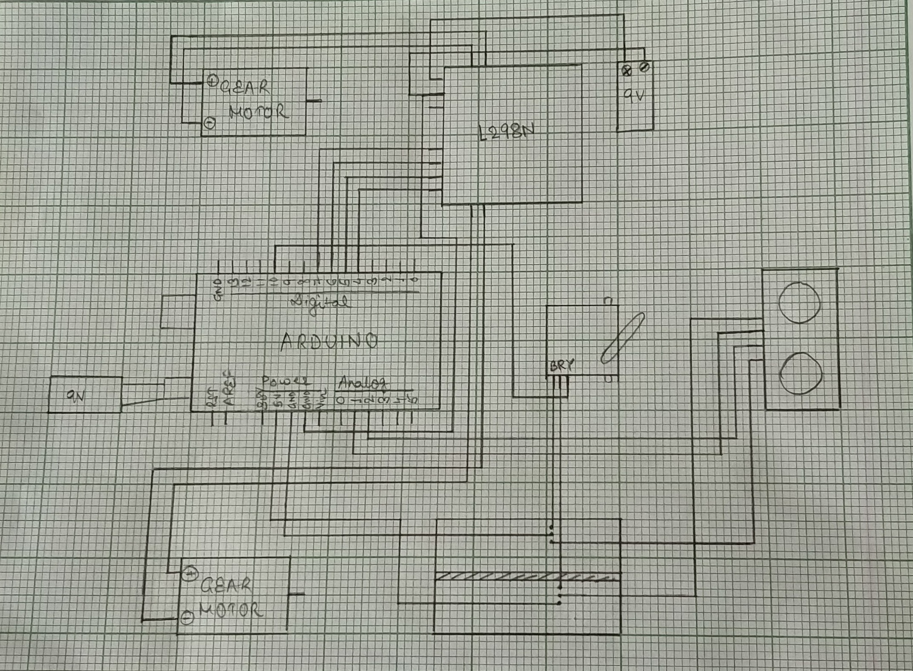

# Hindrance Avoidance Robot
This repository contains the code and documentation for a hindrance avoidance robot that I built using an Arduino UNO R3, SG90 Micro Servo Motor, HC-SR04 Ultrasonic Sensor, L293D Motor Driver/Servo Shield for Arduino.

## Features
The robot is able to detect obstacles using the HC-SR04 Ultrasonic Sensor and avoid them by adjusting its direction using the SG90 Micro Servo Motor.
The L293D Motor Driver/Servo Shield for Arduino and the L298N 2A Based Motor Driver Module are used to control the robot's motors and ensure smooth movement.

## Requirements
- Arduino IDE
- L293D Motor Driver/Servo Shield for Arduino
- L298N 2A Based Motor Driver Module
- HC-SR04 Ultrasonic Sensor
- SG90 Micro Servo Motor
- Standard Remote Control or Smartphone with Bluetooth
- 4 DC Motors
- 9V battery or power supply for the motors
- 4 Wheels
- 1 Chassis
- Connecting Wires/Jumper Wires

## Usage
1. Connect the HC-SR04 Ultrasonic Sensor, SG90 Micro Servo Motor, L293D Motor Driver/Servo Shield for Arduino, and the DC Motors to the Arduino UNO R3 as per the wiring diagram.
2. Upload the code in the repository to the Arduino UNO R3 using the Arduino IDE.
3. Connect the power supply for the motors and switch on the robot.

## Wiring Diagram

## Note
This robot is for educational and hobby purposes only. Always make sure to use appropriate safety precautions when building and operating your robot.
